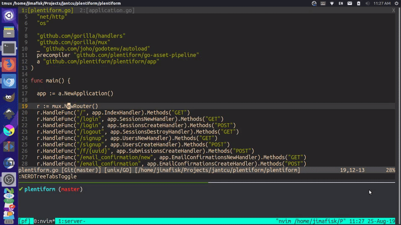
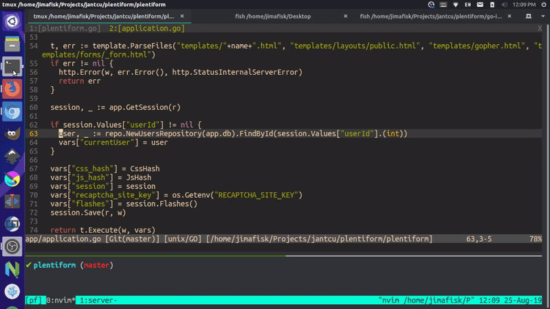
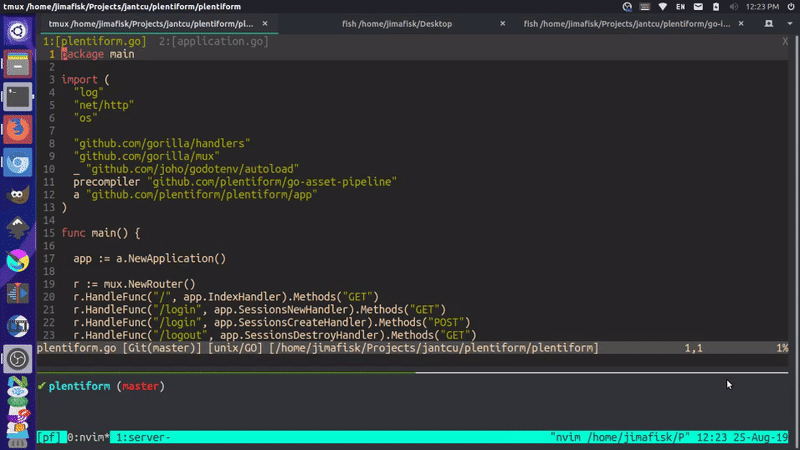
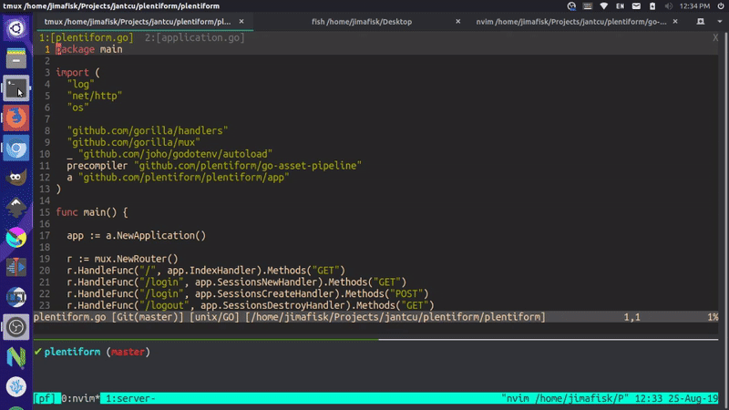
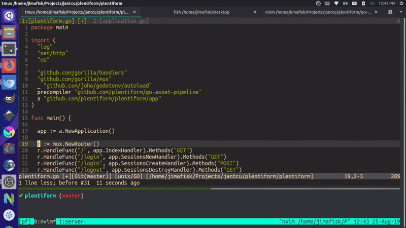
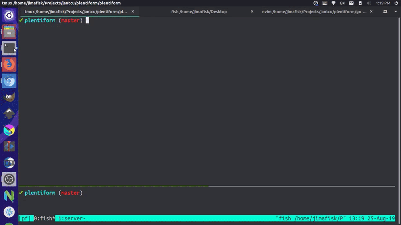
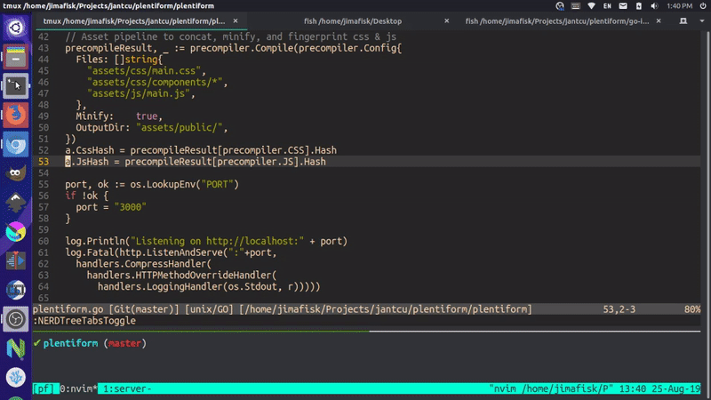

go-ide
===


## Description

This project is a lightweight, [Neovim](https://neovim.io/) integrated development environment (IDE) for [Golang](https://golang.org/) development.

## Prerequisites

1. Install golang: https://golang.org/doc/install
2. Fix paths by adding the following to `~/.bashrc` (Ubuntu) or `~/.bash_profile` (Mac):
```
export GOPATH=$HOME/go
export PATH=$GOPATH/bin:/usr/local/go/bin:$PATH
```
(make sure to run `source ~/.bashrc` / `source ~/.bash_profile` or open a new terminal to apply changes)

2. Install gocode: `go get -u github.com/stamblerre/gocode`
3. Install python support for neovim: `pip3 install pynvim`
4. Install neovim: https://github.com/neovim/neovim/wiki/Installing-Neovim
5. Install vim-plug: https://github.com/junegunn/vim-plug#installation

## Installation

1. Make sure you meet the prerequisites above ^
2. Download the [config file](https://raw.githubusercontent.com/plentiform/go-ide/master/init.vim): 
```
cd ~/Downloads/; wget https://raw.githubusercontent.com/plentiform/go-ide/master/init.vim
```
or
```
cd ~/Downloads/; curl -o init.vim https://raw.githubusercontent.com/plentiform/go-ide/master/init.vim
```
3. Make the configuration directory if it doesn't already exist: `mkdir -p ~/.config/nvim`
4. Move the downloaded file to the correct location: `mv ~/Downloads/init.vim ~/.config/nvim/.`
5. Edit the new configuration file: `nvim ~/.config/nvim/init.vim`
6. If the plugins didn't automatically install, press colon `:` then type `PlugInstall` and press <kbd>Enter</kbd>
7. Use vim-go to install binaries, press colon `:` then type `GoInstallBinaries` and press <kbd>Enter</kbd>

## Features

- File browser: `nt`



- File search: <kbd>Ctrl</kbd>-`f`



- Text search: `/` then type your search terms (find terms <kbd>Enter</kbd>, next `n`, previous `N`, clear highlight <kbd>Ctrl</kbd>-`l`)



- Go to definition: `gd` (traverse back with <kbd>Ctrl</kbd>-`o`)



- Method and property completion (cycle forward: <kbd>Tab</kbd>, cycle backward <kbd>Shift</kbd>-<kbd>Tab</kbd>, select <kbd>Enter</kbd>)



- Snippets / shortcuts (next input <kbd>Ctrl</kbd>-`j`, previous input <kbd>Ctrl</kbd>-`k`)



- Debugger



- Auto imports and tab formatting


